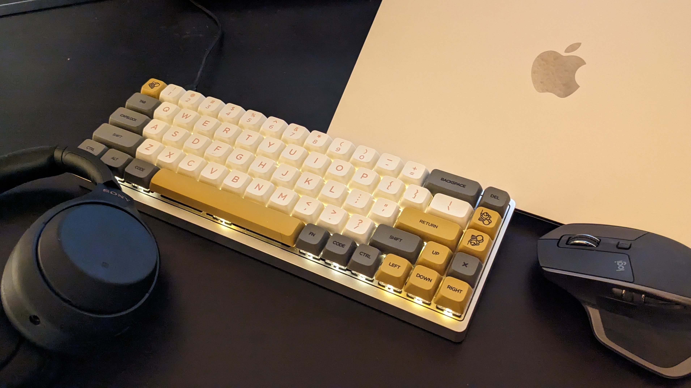
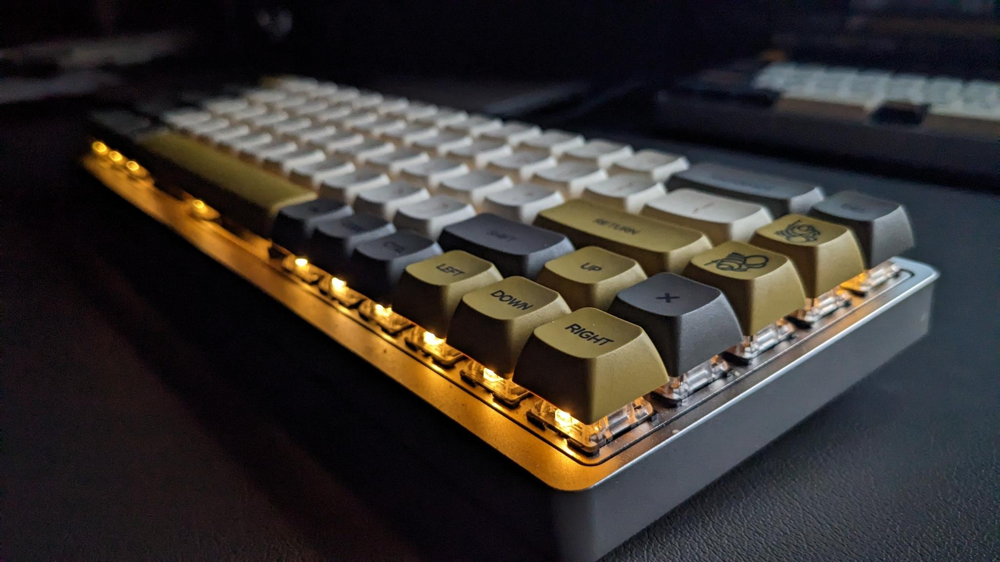

# Honey Smooth

<!-- post thumbnail picture here -->

## Introduction

This was the first board I've ever built. As such, I believe it would be appropriate to write a little bit about my learning process as I went about building and customizing it.

Also, just a very quick side-note: I find it rather amusing that I'm using this exact board to write this article.

---

## Specs

- Keyboard: KBDFans Tada68 (soldered)
- Case Color: Silver
- Plate Material: Aluminum
- Switches:
    - Gateron Black (65g)
    - Lubricated with Krytox 205g0
    - Stabilized with 0.15mm clear polycarbonate films
- Keycaps:
    - XDA Profile
    - PBT Dye-subliminated legends
- 1.8mm through-hole LED

---

## Story

It was April 2021. I had little to no experience in soldering, lubrication, or anything to do with keyboards other than typing. But I was determined to get into the hobby -- for the customizability, for the click-clacks, and for the community. So I ordered a kit with little knowledge of what I was getting myself into.

This was my first ever custom keyboard, introducing me to the scene of DIY and custom mechanical builds. While I started off with an OEM gaming board, a majority of my life and interaction with computers was with membrane keyboards. So when it came time to build this board, it was a very exciting event for me. My main intention with this board was to immerse myself in the environment of building custom boards and learning as much as I can. To this point, it was designed to help me also learn my own preferences in a custom board and explore possible options for future builds. I ordered parts that would allow for the most repetition, which offered a lot of practice to refine my hands-on skills with custom electronics including keyswitch lubrication and soldering.

### Research

From my previous gaming board (using non-lubricated Cherry MX Red switches), I knew I wanted to use linear switches as I preferred a uniform action while typing and gaming. From absolutely everywhere I looked, I read that lubrication drastically improves switch sound and feel, so I found some tools to help with the lubrication process and learned where to apply the grease. While my primary aim was to learn from this build, I also wanted to make something that I would be happy using daily. So I went from a TKL gaming keyboard to a 65% to reduce on costs while still providing me with all the keys I'd need on a normal day (the arrow cluster is very regularly used on my boards). From here, I was sure I was ready to order everything. It took all of a few minutes to find the most budget-friendly parts and even look for further discounts from other websites. After this, it was time to wait for all the parts to ship!

### Build Process

Alright, the parts have been shipped, what's the next step?

#### Lubrication and Preparation

At this point, I've watched quite a few videos on lubing switches and stabilizers, but now as the time to put it all to the test. I got to work, following the videos as a guide while experimenting using differing amounts of lube per each part. After about ten or so switches, I started to get the hang of the process. And so I started to lube the stabilizers before installing them. As with the guides, I tested the sound of the stabilizers with some modded switches and some keycaps from my older keyboard. It sounded alright enough to my untrained ear, so I turned on a nice D&D podcast and proceeded to lube and film the rest of the 70 switches I've allocated to this build.

#### The Hot Stuff (Soldering)

The soldering process went rather smooth thanks to some of my previous experience with soldering through-hole and surface-mount electronics. However, I was only equipped with a beginner's soldering iron, some wick for mistakes, and a wet sponge to clean the tip. That all being said, beside having to remove one switch after it was already soldered (due to the switch not making proper contact and actuating when tested), I had no issues installing the switches to this board. In fact, it was quite a therapeutical activity for me to parttake in after a day of onboarding for my internship.

#### Finishing the Job

After screwing in the plate to the case and installing keycaps, the board was finished (albeit with temporary caps as I had a new keycap set being shipped in the mail at the time). Overall, it was a very solid build with a predictable feel and smooth actuation motion. But at the end of the day, it was ultimately built for one simple thing: typing. And it feels really good when typing. In fact, I still use this keyboard for most of my typing, writing, productivity, and general computer usage when sat at my desk.

However, it wasn't anything special for the fact of the stabilizers not being clipped (due to me not having flush cutters on hand at the time) or even having a band-aid mod installed (as I didn't know how that would benefit the sound signature). No, it was special because it was something I built. It helped me learn not only how a keyboard was built, but also how to tune specific configurations in the hardware, the firmware, and even change how the keyboard feels. It gave me ideas on how I'd want my next board to feel, gave me the ability to think outside of just uniform switch layouts and experiment with different concepts. It was something that I felt was my diving board into the world of not only mechanical keyboards, but DIY electronics as a whole. I felt confident enough after building this keyboard that I went on to build quite a few more boards before taking on commissions.

---

## Gallery

<!--  -->

